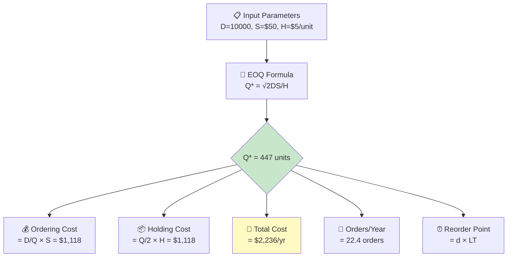

# 📊 EOQ Calculator Python

<p align="center">
  
  
  
  
</p>


*Economic Order Quantity optimizer with total cost analysis — finding the sweet spot between ordering costs and holding costs*

---

## 📋 Overview

The **Economic Order Quantity (EOQ)** model is the foundational inventory management formula, first derived by Ford W. Harris in 1913 and later popularized by R.H. Wilson. Despite being over a century old, EOQ remains the starting point for virtually every inventory optimization system in production today.

This calculator implements the classic EOQ formula along with extensions for quantity discounts, planned shortages, and sensitivity analysis. It computes the optimal order quantity that minimizes the total annual cost — the sum of ordering costs (purchase orders, receiving, inspection) and holding costs (warehousing, insurance, capital, obsolescence).

**Key capabilities:**
- Classic EOQ with Wilson's formula: Q* = √(2DS/H)
- Total cost decomposition: ordering cost, holding cost, purchase cost
- Reorder point calculation with lead time demand
- Sensitivity analysis — how total cost changes with order quantity variations
- Number of orders per year and time between orders

---

## 🏗️ Architecture



---

## ❗ Problem Statement

### The Inventory Cost Trade-Off

Every purchasing manager faces this fundamental tension:

| Strategy | Order Frequency | Inventory Level | Ordering Cost | Holding Cost | Total Cost |
|----------|----------------|-----------------|---------------|--------------|------------|
| **Order often, small lots** | High (52x/yr) | Low | High ↑ | Low ↓ | Sub-optimal |
| **Order rarely, large lots** | Low (4x/yr) | High | Low ↓ | High ↑ | Sub-optimal |
| **EOQ (optimal)** | Balanced | Balanced | Equal | Equal | **Minimized** |

At the EOQ point, annual ordering cost equals annual holding cost — this is the mathematical optimum. Deviating ±20% from EOQ typically increases total cost by only 2-3%, making EOQ remarkably robust.

> *"The EOQ formula tells us that inventory should be managed with a square root relationship to demand — doubling demand should increase order quantities by only 41%."*

---

## ✅ Solution Methodology

1. **Input Parameters** — Annual demand (D), ordering cost per order (S), holding cost per unit per year (H), and unit purchase price
2. **EOQ Computation** — Q* = √(2DS/H), the order quantity where marginal ordering cost equals marginal holding cost
3. **Total Cost Analysis** — TC = (D/Q)×S + (Q/2)×H + D×P, decomposed into ordering, holding, and purchasing components
4. **Reorder Point** — ROP = d × L, where d is daily demand and L is lead time in days
5. **Sensitivity Output** — How total cost varies across a range of order quantities centered on EOQ

---

## 💻 Quick Start

### Prerequisites

| Requirement | Version |
|-------------|---------|
| Python | 3.8+ |
| pip | Latest |

### Installation

```bash
git clone https://github.com/virbahu/eoq-calculator-python.git
cd eoq-calculator-python
pip install -r requirements.txt
```

### Usage

```python
from eoq_calculator import calculate_eoq

# Scenario: 10,000 units/year demand, $50/order, $5/unit/year holding
result = calculate_eoq(
    annual_demand=10000,
    order_cost=50,
    holding_cost=5
)

print(f"Optimal Order Quantity: {result['eoq']:.0f} units")
print(f"Annual Ordering Cost:  ${result['ordering_cost']:,.2f}")
print(f"Annual Holding Cost:   ${result['holding_cost']:,.2f}")
print(f"Total Annual Cost:     ${result['total_cost']:,.2f}")
print(f"Orders per Year:       {result['orders_per_year']:.1f}")
print(f"Time Between Orders:   {result['days_between_orders']:.0f} days")
```

---

## 📦 Dependencies

```
numpy
matplotlib
```

---

## 📚 Academic Foundation

| | |
|---|---|
| **Based on** | Professor Professor Ford W. Harris / R.H. Wilson, Classic Operations Research |
| **Key Reference** | Harris (1913) *How Many Parts to Make at Once.* Factory, The Magazine of Management, 10(2), 135-136. |

---

---

## 👤 Author

**Virbahu Jain** — Founder & CEO, [Quantisage](https://quantisage.com)

> Building the AI Operating System for Scope 3 emissions management and supply chain decarbonization.

| | |
|---|---|
| 🎓 **Education** | MBA, Kellogg School of Management, Northwestern University |
| 🏭 **Experience** | 20+ years across manufacturing, life sciences, energy & public sector |
| 🌍 **Scope** | Supply chain operations on five continents |
| 📝 **Research** | Peer-reviewed publications on AI in sustainable supply chains |

---

## 📄 License

MIT License — see [LICENSE](LICENSE) for details.

Part of the **Quantisage Open Source Initiative** | AI × Supply Chain × Climate
